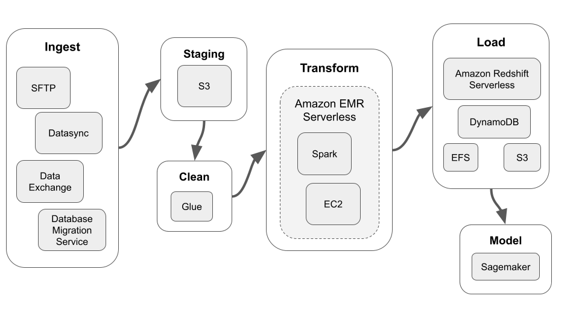

# What is a Data Lake? Explain its benefits, how it differs from a data warehouse, and how it might benefit a client.  
A Data Lake is a central repository for any type of data. The key benefit with a Data Lake is that it can hold just about any type of structured or unstructured data (like videos, audio, etc) in a very raw state. This is notably different from a data warehouse which can only store relational data (think rows and columns). A Data Lake can be beneficial over a data warehouse if there is a need to store various types of data and if the processes are not put in place to clean and process raw data. 
# Explain serverless architecture.  What are its pros and cons? 
No application is truly serverless in the sense that it is without a server. A serve” is the core piece of infrastructure that an application runs on. The term “serverless architecture” refers to an architecture where the design, set up, and management of the server is done by someone else. By using a serverless architecture, developers of an application do not need to develop the server along with their application and they only need to focus on the application. Serverless architecture offers the benefit of being able to morph and scale depending on the needs of the application. This allows for a very flexible platform to build an application on and can expedite the time to deployment. There are a few considerations, however, as the most common downsides of serverless architecture are security and troubleshooting. Allowing another organization to process and handle data may not be conducive to use cases with highly sensitive data. Additionally, troubleshooting can be challenging as developers do not have control of the entire development. 
# Please provide a diagram for an ETL pipeline (e.g., Section 2) using serverless AWS services. Describe each component and its function within the pipeline. 

### Ingest 
Data can be ingested into AWS through a variety of different services. SFTP and Data Exchange can be used for files and data from third parties while Datasync and the Database Migration Service can be used to ingest file stores and databases.
### Staging
AWS S3 serves a general purpose but scalable file storage solution. This makes it the ideal landing/staging location for the raw ingested data. 
### Clean 
It is often necessary to perform some light cleaning on the data before it can be passed to other processing stages. AWS Glue makes it easy to perform some manipulations on the data and connect it to other services.
### Transform
In this diagram, Apache Spark is used to perform transformations on large amounts of data. Amazon EMR provides a serverless architecture for deploying Spark clusters and connecting them to their required resources, such as EC2 instances. 
### Load
After the data is processed with Spark, it can be loaded into various types of file stores and databases depending on the use case. Listed in the diagram are just a few of the options that would support this serverless ETL pipeline including Amazon Redshift Serverless, DynamoDB, EFS and S3. 
### Model
With the data transformed and loaded into a database, ready for analytics, Sagemaker can be used to train and deploy machine learning models. 
# Describe modern MLOps and how organizations should be approaching management from a tool and system perspective. 
Modern machine learning and artificial intelligence applications require systems that allow for rapid prototyping, CI/CD, and scalability. Today’s use cases, practical applications, and capabilities of ML and AI are rapidly changing and organizations must implement tools and systems to capitalize on this growth. To do this, organizations must manage their systems in a way that allows developers to adapt to this ever-changing environment. This should then be the number one focus for organizations as they build out their MLOps capabilities: **Choose the tooling that best supports the developers**. The tools and systems obviously need to support the application and the business initiatives, **but it is the developers rather than the tools**, who will have the most impact on an organization's ability to grow and scale. 

